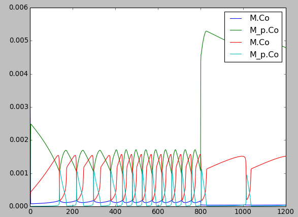
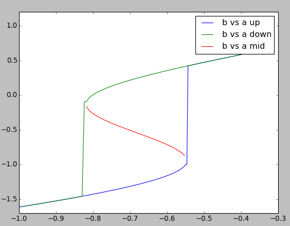

.. A cookbook for MOOSE
.. Lists all the snippets in Demos/snippets directory

MOOSE Cookbook   
==============

The MOOSE Cookbook contains recipes showing you how to do specific
tasks in MOOSE.

Loading and running models
--------------------------
This section of the documentation explains how to load and run predefined
models in MOOSE.

Hello, MOOSE: Load, run and display existing models
^^^^^^^^^^^^^^^^^^^^^^^^^^^^^^^^^^^^^^^^^^^^^^^^^^^
.. automodule:: helloMoose
   :members:

Computing arbitrary functions on the fly
^^^^^^^^^^^^^^^^^^^^^^^^^^^^^^^^^^^^^^^^
Sometimes you want to calculate arbitrary function of the state
variables of one or more elements and feed the result into another
element during a simulation. The Function class is useful for this.

.. automodule:: function
   :members:
            
The Hodgkin-Huxley demo
^^^^^^^^^^^^^^^^^^^^^^^
This is a self-contained graphical demo implemented by Subhasis Ray,
closely based on the 'Squid' demo by Mark Nelson which ran in GENESIS.

.. figure:: images/squid_demo.png
   :alt: Hodgkin-Huxley's squid giant axon experiment

   Simulation of Hodgkin-Huxley's experiment on squid giant axon
   showing action potentials generated by a step current injection.
      

The demo has built-in documentation and may be run from the 
``Demos/squid``
subdirectory of MOOSE.

Start, Stop, and setting clocks
^^^^^^^^^^^^^^^^^^^^^^^^^^^^^^^
.. automodule:: startstop
   :members:

Accessing and tweaking parameters
^^^^^^^^^^^^^^^^^^^^^^^^^^^^^^^^^
.. automodule:: tweakingParameters
   :members:

Storing simulation output
^^^^^^^^^^^^^^^^^^^^^^^^^
Here we'll show how to store and dump from a table and also using HDF5.

.. automodule:: tabledemo
   :members:
   
.. automodule:: hdfdemo
   :members:

Chemical Signaling models
-------------------------
This section of the documentation explains how to do operations specific
to the chemical signaling.

Running with different numerical methods
^^^^^^^^^^^^^^^^^^^^^^^^^^^^^^^^^^^^^^^^
.. automodule:: switchKineticSolvers
   :members:

Changing volumes
^^^^^^^^^^^^^^^^
.. automodule:: scaleVolumes
   :members:

Feeding tabulated input to a model
^^^^^^^^^^^^^^^^^^^^^^^^^^^^^^^^^^
.. automodule:: analogStimTable
   :members:

Finding steady states
^^^^^^^^^^^^^^^^^^^^^
.. automodule:: findChemSteadyState
   :members:

Making a dose-response curve
^^^^^^^^^^^^^^^^^^^^^^^^^^^^

.. automodule:: chemDoseResponse
   :members:

Building a chemical model from parts
^^^^^^^^^^^^^^^^^^^^^^^^^^^^^^^^^^^^
Disclaimer: Avoid doing this for all but the very simplest models. This
is error-prone, tedious, and non-portable. For preference use one of the
standard model formats like SBML, which MOOSE and many other tools can
read and write.

Nevertheless, it is useful to see how these models are set up. 
There are several tutorials and snippets that build the entire chemical
model system using the basic MOOSE calls. The sequence of steps is
typically:

    #. Create container (chemical compartment) for model. This is typically
       a CubeMesh, a CylMesh, and if you really know what you are doing,
       a NeuroMesh.
    #. Create the reaction components: pools of molecules **moose.Pool**;
       reactions **moose.Reac**; and enzymes **moose.Enz**. Note that when
       creating an enzyme, one must also create a molecule beneath it to
       serve as the enzyme-substrate complex.  Other less-used
       components include Michaelis-Menten enzymes **moose.MMenz**, input
       tables, pulse generators and so on. These are illustrated in other
       examples.
    #. Assign parameters for the components. 

        * Compartments have a **volume**, and each subtype will have 
          quite elaborate options for partitioning the compartment 
          into voxels.
        * **Pool** s have one key parameter, the initial 
          concentration **concInit**.
        * **Reac** tions have two parameters: **Kf** and **Kb**. 
        * **Enz** ymes have two primary parameters **kcat** and **Km**. 
          That is enough for **MMenz** ymes. Regular **Enz** ymes have
          an additional parameter **k2** which by default is set to 4.0
          times **kcat**, but you may also wish to explicitly assign it
          if you know its value.

    #. Connect up the reaction system using moose messaging.
    #. Create and connect up input and output tables as needed.
    #. Create and connect up the solvers as needed. This has to be done
       in a specific order. Examples are linked below, but briefly the
       order is:
       
       a. Make the compartment and reaction system.
       b. Make the Ksolve or Gsolve.
       c. Make the Stoich.
       d. Assign **stoich.compartment** to the compartment
       e. Assign **stoich.ksolve** to either the Ksolve or Gsolve.
       f. Assign **stoich.path** to finally fill in the reaction system.

       There is an additional step if diffusion is also present, see
       `Reaction-diffusion in a cylinder`_.

Some examples of doing this are in:

    * `Making a dose-response curve`_ , which defines a small bistable
      system including three **Pool** s, two **Enz** ymes and a 
      **Reac** tion.
    * `Feeding tabulated input to a model`_, which shows how to connect up
      a **StimulusTable** object to a simple 2-molecule reaction.
    * `Reaction-diffusion in a cylinder`_, which defines a simple binding
      reaction and embeds it in a 1-dimensional diffusive volume of 
      a cylinder.

The recommended way to build a chemical model, of course, is to load it
in from a file format specific to such models. MOOSE understands
**SBML**, **kkit.g** (a legacy GENESIS format), and **cspace** 
(a very compact format used in a large study of bistables).

One key concept is that in MOOSE the components, messaging, and access
to model components is identical regardless of whether the model was
built from parts, or loaded in from a file. All that the file loaders do
is to use the file to automate the steps above. Thus the model components
and their fields are completely accessible from the script even if
the model has been loaded from a file. See 
`Accessing and tweaking parameters`_ for an example of this.

Oscillation models
^^^^^^^^^^^^^^^^^^
There are several chemical oscillators defined in the 
``Demos/tutorials/ChemkcalOscillators`` directory. These include:

1. Slow Feedback Oscillator based on a model by Boris Kholdenko

.. automodule:: slowFbOsc
   :members:

2. Repressilator, based on Elowitz and Liebler, Nature 2000.

.. automodule:: repressillator
   :members:

3. Relaxation oscillator.

.. automodule:: relaxationOsc
   :members:

Bistability models
^^^^^^^^^^^^^^^^^^
There are several bistable models defined in the 
``Demos/tutorials/ChemkcalBistables`` directory. These include:

1. MAPK feedback loop model.

.. automodule:: mapkFB
   :members:

2. Simple minimal bistable model, run stochastically at different volumes
   to illustrate the effects of chemical noise.

.. automodule:: scaleVolumes
   :members:

3. Strongly bistable model.

.. automodule:: strongBis
   :members:

Reaction-diffusion models
-------------------------
The MOOSE design for reaction-diffusion is to specify one or
more cellular 'compartments', and embed reaction systems in each of them.

A 'compartment', is used in the cellular sense of a biochemically defined,
volume restricted subpart of a cell. Many but not all compartments
are bounded by a cell membrane, but biochemically the membrane itself
may form a compartment.

A reaction system can be loaded in from any of the supported MOOSE
formats, or built within Python from MOOSE parts.

The computations for such models are done by a set of objects: 
Stoich, Ksolve and Dsolve. Respectively, these handle the model 
reactions and stoichiometry matrix, the reaction computations for 
each voxel, and the diffusion between voxels. The 'Compartment' specifies
how the model should be spatially discretized.

Reaction-diffusion + transport in a tapering cylinder
^^^^^^^^^^^^^^^^^^^^^^^^^^^^^^^^^^^^^^^^^^^^^^^^^^^^^
.. automodule:: cylinderDiffusion
   :members:

A Turing model
^^^^^^^^^^^^^^
.. automodule:: TuringOneDim
   :members:

A spatial bistable model
^^^^^^^^^^^^^^^^^^^^^^^^
.. automodule:: propagationBis

Reaction-diffusion in neurons
^^^^^^^^^^^^^^^^^^^^^^^^^^^^^
Reaction-diffusion systems can easily be embedded into neuronal geometries.
MOOSE does so by treating each neuron as a pseudo 1-dimensional object. 
This means that diffusion only happens along the axis of dendritic 
segments, not radially from inside to outside a dendrite, nor tangentially 
around the dendrite circumference.
Here we illustrate two cases. The simple case treats the entire neuron 
as a single, chemically equivalent reaction-diffusion system in a binary
branching neuronal tree. The more complex example shows how to set up
three chemically distinct kinds of subdivisions within the neuron:
the dendritic tree, the dendritic spine heads, and the postsynaptic 
densities. In both examples we embed a simple Turing-like spatial oscillator
in every compartment of the model neurons, so as to see nice oscillations
and animations. The first example has a particularly striking pseudo-3D
rendition of the neuron and the molecular spatial oscillations within it.

.. automodule:: reacDiffBranchingNeuron
   :members:
.. automodule:: reacDiffSpinyNeuron
   :members:

Transport in branching dendritic tree
^^^^^^^^^^^^^^^^^^^^^^^^^^^^^^^^^^^^^
.. automodule:: transportBranchingNeuron
   :members:

Single cell models
------------------

Loading, modifying, saving
^^^^^^^^^^^^^^^^^^^^^^^^^^
Explicit vs. implict methods
^^^^^^^^^^^^^^^^^^^^^^^^^^^^
Integrate-and-fire models
^^^^^^^^^^^^^^^^^^^^^^^^^
The HH model
^^^^^^^^^^^^
Analyzing spike trains
^^^^^^^^^^^^^^^^^^^^^^

Network models
--------------
Connecting two cells together
^^^^^^^^^^^^^^^^^^^^^^^^^^^^^
Regular and plastic synapses
^^^^^^^^^^^^^^^^^^^^^^^^^^^^
Providing random input to a cell
^^^^^^^^^^^^^^^^^^^^^^^^^^^^^^^^
Recurrent integrate-and-fire network
^^^^^^^^^^^^^^^^^^^^^^^^^^^^^^^^^^^^
Recurrent integrate-and-fire network with plastiicty
^^^^^^^^^^^^^^^^^^^^^^^^^^^^^^^^^^^^^^^^^^^^^^^^^^^^
A feed-forward network with random input
^^^^^^^^^^^^^^^^^^^^^^^^^^^^^^^^^^^^^^^^
Using compartmental models in networks
^^^^^^^^^^^^^^^^^^^^^^^^^^^^^^^^^^^^^^

Multiscale models
-----------------
Single-compartment multiscale model
^^^^^^^^^^^^^^^^^^^^^^^^^^^^^^^^^^^
.. automodule:: multiscaleOneCompt
   :members:

Multi-compartment multiscale model
^^^^^^^^^^^^^^^^^^^^^^^^^^^^^^^^^^

Graphics
--------
Displaying time-series plots
^^^^^^^^^^^^^^^^^^^^^^^^^^^^
Animation of values along an axis
^^^^^^^^^^^^^^^^^^^^^^^^^^^^^^^^^
Using MOOGLI widgets to display a neuron
^^^^^^^^^^^^^^^^^^^^^^^^^^^^^^^^^^^^^^^^

		
